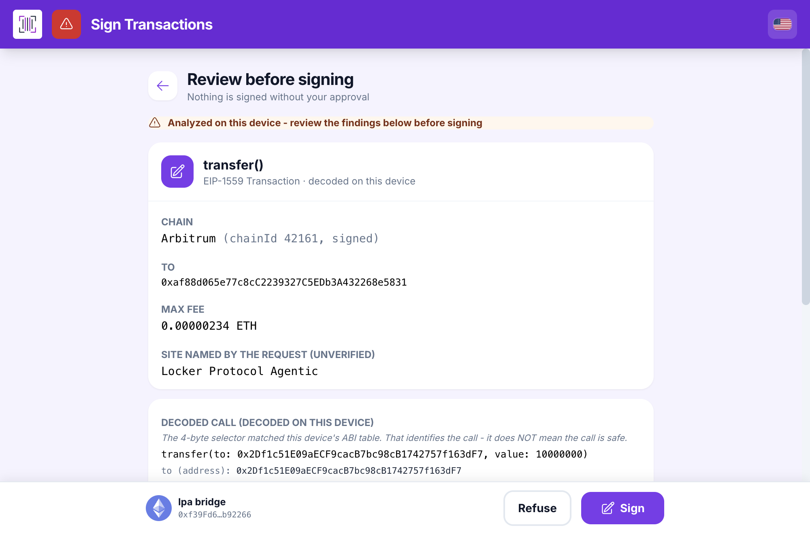
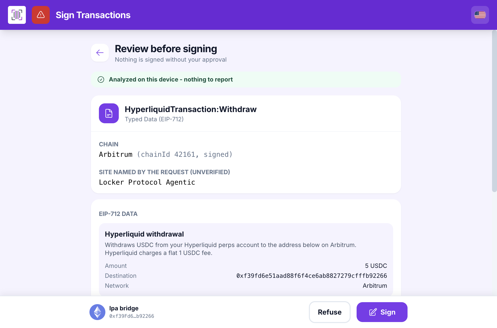
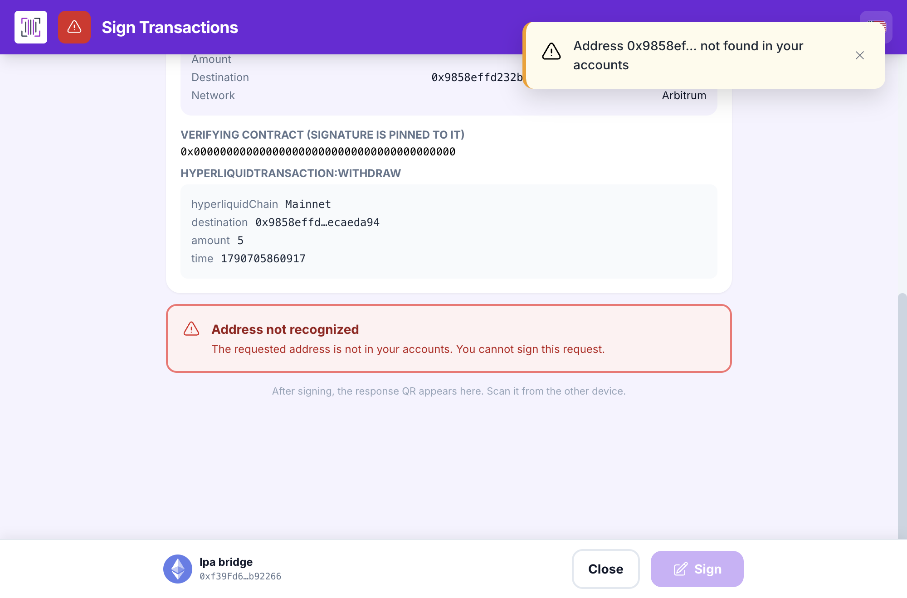

# Setting up with Locker Vault, step by step

**Your private key is nowhere: not on our servers, not on the agent's machine, not with anyone.**

The agent trades. It holds nothing.

`lpa init` pairs this computer with Locker Vault and creates a trading agent. Two QR codes
travel each way: the vault shows its accounts, this computer shows what there is to sign, and
the phone signs. The account's private key never leaves the phone, and no program here ever
sees it.

About ten minutes the first time. You need `lpa`, a webcam, a phone with Locker Vault, and a
Hyperliquid account with some USDC on it.

**You do not need any of this to start.** `lpa paper init --budget 1000` opens a paper account
that fills on the real order book with the real fees, and it works before `lpa init`. Come back
here when paper is not enough.

## What you need

| | |
|---|---|
| `lpa` | `npm install -g @locker-protocol/agent-wallet-hyperliquid-trader@latest`, Node 22.13 or later |
| A phone or tablet | With Locker Vault installed and an EVM account in it |
| A webcam | On the computer that runs `lpa`. The ceremony page reads the phone's screen through it |
| A browser | The page is served on `127.0.0.1`, which browsers treat as a secure context, so the camera works |
| USDC on Arbitrum | Hyperliquid refuses every action from an account that has never been funded |
| A little ETH on Arbitrum | For the gas of the deposit transaction |

A dedicated account is the real bound of this whole design: the most that can be lost is what is
deposited on it. `lpa init` recommends one.

## 0. Before you start

```sh
lpa doctor
```

On a computer where nothing is set up yet:

```
ok    node         Node 24.21.0
ok    home         /home/you/.lpa mode 700
-     config       no config.json yet
ok    hyperliquid  api.hyperliquid.xyz answers in 275 ms; clock drift 594 ms
-     account      no vault account yet: run lpa init
Something needs attention.
```

`lpa doctor` signs nothing and asks for nothing. It is the command to run whenever something
looks wrong. The clock matters: Hyperliquid's nonces are timestamps, and `doctor` refuses a
drift past its tolerance.

## 1. Start the ceremony

```sh
lpa init
```

Optional flags:

| Flag | What it does |
|---|---|
| `--days 180` | How long the agent key stays valid. 180 by default and at most, the longest Hyperliquid allows |
| `--account <index or 0x...>` | Which account of the vault to use. Asked otherwise |

The terminal opens a page on this computer, at a `127.0.0.1` address. Leave the terminal open:
the password is typed there, not in the page.

On a machine with no screen of its own, a server reached over SSH, `lpa` prints the line to
forward the port and the address to open from your own computer. Nothing is sent anywhere else.

## 2. The vault shows its accounts

On the phone: Locker Vault, the **Sync** screen. It shows a QR code holding the public part of
its accounts, the addresses and their derivation paths. No key, no phrase, nothing secret.

Hold the phone in front of the webcam. The page reads the code and lists the accounts it found.
Pick the one to trade with, or pass it with `--account`.

The screen of the vault that offers this sync was written for the browser extension and names
it. For `lpa` it is the same QR code, and it works the same way; the wording is being changed.

## 3. This computer makes the agent key, and seals it

Still in the terminal, `lpa` asks for a password, twice, at least 10 characters.

Then, in this order:

1. A fresh agent key is generated here, on this computer.
2. It is sealed with that password (AES-GCM, the key derived by PBKDF2) and written to
   `~/.lpa`, mode 0600. It never touches the disk in clear.
3. Only then is the approval built for the phone to sign.

Sealed before the approval, on purpose: a terminal closed halfway through never leaves an
approved agent whose key was lost.

## 4. The phone approves the agent

The page shows an animated QR code. Scan it with Locker Vault, which decodes it, shows a review
card, and waits.

The card says what is being signed: **Approve a Hyperliquid trading agent**, typed data
(EIP-712) on Arbitrum, the agent's address, and the date it expires. The site named by the
request is `Locker Protocol Agentic`, marked unverified, as every request is.

That card is the one screenshot missing from this page. Its wording says the key "lives in the
browser extension", which is not where `lpa` puts it (`lpa` seals it in `~/.lpa`), and says it
can never transfer funds, which is not exactly true of the key itself: Hyperliquid does let an
agent key sign `vaultTransfer`, and it is `lpa`'s guardian, not Hyperliquid, that closes that
door. The wording is being corrected in the vault. The screenshot goes here once it is.

Read the card, press **Sign**, and hold the phone's answer, another QR code, in front of the
webcam. `lpa` checks that the answer belongs to the request it sent.

## 5. One last signature finishes the setup

A second card, the same way:


Typed data on Arbitrum again, the maximum rate and the address it goes to. Refuse it and nothing
breaks: orders simply go out without it, and are never blocked. That is the whole of the
fail-safe.

## 6. Check, then unlock

```sh
lpa status
lpa doctor
```

`doctor` now names the account, the agent and the days it has left.

```sh
lpa unlock
```

`lpa unlock` asks for the password and starts the guardian, a background process that holds the
agent key in memory and signs orders. Nothing else ever sees the key or the password: not the
agent, not the assistant, not the MCP server. `lpa unlock --hours <n>` bounds how long it stays.

```sh
lpa lock
```

takes the key back out of memory.

## 7. Fund it

```sh
lpa wallet address
lpa wallet balances
lpa perps deposit --amount 25
```

The deposit is an Arbitrum transaction, so the phone signs it as a transaction, not as typed
data:



The vault decodes the call on the device: the chain, the contract, the recipient and the amount.
It shows the addresses rather than the names; the page in your browser names them. `--source-chain-id`
takes the deposit from another chain.

Taking money back out is the same ceremony the other way:

```sh
lpa perps withdraw --amount 5
```



Hyperliquid charges a flat 1 USDC on a withdrawal, which the card says. `lpa perps transfer
--amount 3 --to-dex <name>` moves margin between the main dex and a HIP-3 dex, and is signed the
same way.

## What the vault refuses

A request for an account the vault does not hold is refused outright, and the Sign button stays
inactive:



The match is on the address. A signature that answers a different request is refused on this
side too, by `lpa`, before anything reaches Hyperliquid.

## After the setup

| Command | What it does |
|---|---|
| `lpa unlock` / `lpa lock` | The guardian holds the agent key / takes it out of memory |
| `lpa status`, `lpa doctor` | Where things stand; what needs attention |
| `lpa journal --since 24h` | What was done, refused and paid |
| `lpa policy show`, `lpa policy set` | The limits checked before every order |
| `lpa config` | A local settings page: assistant, limits, paper trading, account |
| `lpa agent revoke --yes` | Retire the agent now. Signed on the phone |
| `lpa reset` | Wipe the local state. The program stays |

The agent key expires on its own, seven days after `lpa init` by default, and Hyperliquid stops
accepting it. `lpa doctor` says how long is left. Renewing is the same ceremony: run `lpa init`
again.

## What an AI agent must not try here

`lpa init` and `lpa unlock` are typed by a person. An agent has no camera, no phone and no
password. When a command answers `NOT_INITIALIZED` or `LOCKED`, the answer is to tell the user
which line to type, and stop.

## The screenshots on this page

Three of them, and the refusal, come from a run where Locker Vault itself read each request
through its camera, showed it, signed it and answered, on 2026-09-29. They are the vault's own
review cards, not mock-ups.

The card of step 4, the agent approval, is deliberately absent: its wording is wrong for `lpa`
and is being corrected. **To add here once the vault ships the new wording:** the agent approval
card of `lpa init` (step 4), and the same card as `lpa agent revoke` shows it.

## check.sh

```sh
./check.sh
```

The ceremony needs a phone and a webcam, so the check covers everything around it: that every
command and every flag this page names really exists (`lpa <command> --help`), that `lpa doctor`
on a blank folder says to run `lpa init`, that a command needing the account refuses with
`NOT_INITIALIZED` rather than doing anything, that the paper account works without any of this,
and that every image the page links to is there.

It works in a throwaway `LPA_HOME` it deletes at the end, signs nothing and opens no page.

```sh
LPA_BIN=/path/to/packages/agentic/bin/lpa.js ./check.sh
```
